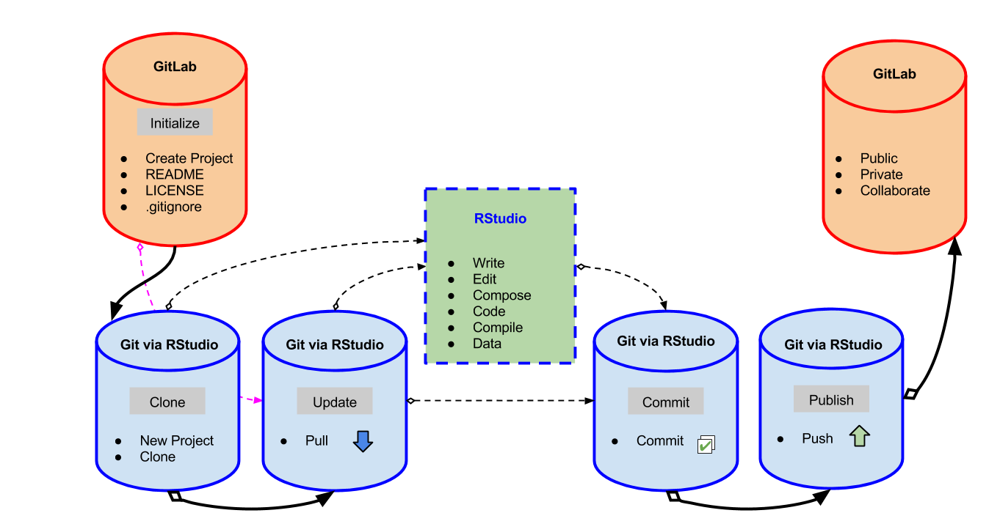
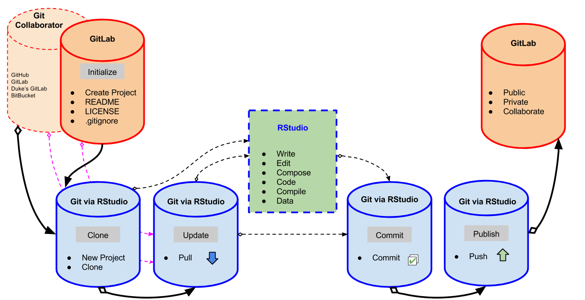
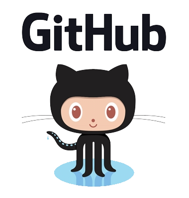

exclude: true

```{r, message=FALSE, warning=FALSE, include=FALSE}
library(tidyverse)
library(DT)
```


---
class: middle, center

Hands-on portion of the workshop:

## Reproducibility: Data Management, Git, & RStudio Workshop
https://osf.io/r6wfk/

&nbsp;

Part of the 
### [RFun](http://rfun.library.duke.edu) Learning Series

[Other Rfun Workshops](https://rfun.library.duke.edu/categories/workshops/)

???

This is a presenter comment for the presenter mode

use 'p' to toggle the presenter mode or '?' or 'h' to toggle the help / key-shortcut options


---
class: middle, center

### Goal

# Compose a Reproducible Document

---
class: middle

## Literate Code --> Reproducible Research

## Collaborative

## Transparent Process

---
class: middle

## Why RStudio?

- **Reproducibility** is a Top Priority

- R / RStudio for Composition, Analysis, Reproducible Publishing

    - **RStudio orchestrates Git**

- **Git for Version Control**

    - Git can be a pain to configure but works well in the background
    - Leapfrog beyond the barrier of a painful configuration

- **GitLab (GitHub) for open sharing and collaborating** via repositories

---
class: middle
Karl Broman's *[initial steps toward reproducible research](http://kbroman.org/steps2rr/)*

- Organize your data and code
- [Everything with a script](http://kbroman.org/steps2rr/pages/scripts.html)
- **Automate the process**
- **Turn scripts into reproducible reports**
- Turn repeated code into functions
- Package functions for reuse
- Use version control
- License your software

---
class:  middle

## Broman: Everything with a script

The most basic aspect of **reproducible research** is that **everything you do** (convert data files, clean data, analyze data) should be **accomplished via code.** 

*Pointing and clicking, and copy-paste, are not reproducible.*  


???

Goal:  Compose a Reproducible Document **in RStudio**

---
class:  middle, center

## Version Control

 
???

RStudio will manage the most commonly used Git commands
---
class:  middle, center

## Version Control


???
Collaboration adds complexity the but the basic git commands are the same.

---
class: middle, center

Avoid

## Idiosyncratic Critical Steps 

so your processes **are not** reduced to

## Weird Bits of Undocumented Manual Magic

???

For Example...

1. Create Summary **Table in STATA**

2. **Copy** Table to MS **Excel**

3. **Format Table** for readability in Excel

4. Generate **Visualizations** in Excel

5. Integrate Excel Table into **Word > PDF**
---

## Outline

.pull-left[1. Git

1. GitHub and GitLab and Bitbucket

1. Markdown  

1. Orchestrating with RStudio
]

.pull-right[

<figure><figcaption> Image Credit: XKCD.  <a href="https://xkcd.com/1597/">Git</a></figcaption></figure>

]
---
class: center, middle, softblue

## **Git** is a *Version Control System*

---
class: bottom, right
background-image:  url(images/flickr_RupertsDogBoye_trail.jpg)

 
.small-beige[ Image Credit: [Brandon Rasmussen](https://www.flickr.com/photos/137029081@N02/30943501632/in/photostream/) ]

???

Versioning can be used 

- as a kind of **breadcrumb system** that helps track the **research process/workflow**

- Using version control, one can **easily "roll back"** to an earlier moment in the research workflow.

- Leave a documented 

    - **trail of where you've been**
    - how you got there
    - generated as you go

---
## Repositories

.pull-left[

<figure><figcaption> Image Credit: <a href="https://www.flickr.com/photos/dbloete/274563369">Dennis Reimann</a></figcaption></figure><br>


- Source Code Management

- Track changes in any file set

]

.pull-right[

<figure><figcaption> Image Credit: <a href="https://openclipart.org/detail/192197/file-extension-icons">OpenClipart.org</a></figcaption></figure><br>


]

???

### Source Code Mangement
By this I simply mean **version control on a personal level**.  Once can "branch" stages of research and merge successful operations.  In this way it becomes easier to keep track of the process and the progress.

### Tracking changes in **any file set**

**Git** can be used to **track any files**. 

---
class: center, middle, softblue

## Social **git Repositories**

???

- **Social Coding** = collaboration

- Introduce the idea of **LOCKSS**: "Lots of Copies Keeps Stuff Safe."  Now you have copies in the cloud and on local workstations.  You can work in various locations on various computers (e.g. at home and at work) without worrying about version or file location.  (This assumes you've installed **multiple keys**)

- Share **trackable progress** of your reproducible activity

    - even if you are only **sharing with yourself** 

---

.pull-left[
<figure><figcaption> Image Credit: Der Bücherwurm (The Bookworm) by Carl Spitzweg <br><a href="https://commons.wikimedia.org/wiki/File:The_Bookworm_-_Grohmann_Museum.jpg">Wikimedia Commons</a></figcaption></figure>
]
.pull-right[
## Private Repository

- Research Output?

- Statement of Authorship?

- Resarch History / Workflow?

- Collaborators?

- Audience?

]

???

How does this process **affect Reproducibility?**

Library ~= Repository

---
class: bottom
background-image: url(images/Edit-a-thon_lrg.jpg)

.small-beige[ Image Credit: Picture by [Christin & Monica Ho](https://commons.wikimedia.org/wiki/File:Edit-a-thon_at_the_MoMu_library_%289915619823%29.jpg) ]

???

## Public Git Repository

- Social Coding

- Digital and Multi-Media

- Sharing

- Collaboration

- Track Issues


Effective collaboration **extends** the diversity of **input and feedback available** to you.

- Stop emailing code/research/documents

- Never loose work / track progress

- Build a Portfolio

---
exclude: TRUE
## Git Repositories

.pull-left[

<figure><figcaption> Image Credit: 
<a href="https://commons.wikimedia.org/wiki/File:LDEO_DSS_Repository.jpg">Wikimedia Commons</a></figcaption></figure><br>

]

.pull-right[

- Social Coding

- Sharing

- Collaboration

- Track Issues

]

---
exclude: TRUE
class: center


.pull-right[
  .small-txt[
Image Credit: [PixaBay](https://pixabay.com/en/social-media-personal-1635581/)
  ]
]

???

Effective collaboration extends the diversity of input and feedback available to you.  

---
class: center
.pull-left[   ]
.pull-right[   ]

 

???

- Git is not GitHub

- GitLab, GitHub, Bitbucket are all "Public Hubs" which work with Git versioning.


---
class: green, middle, center


## Duke's GitLab

[gitlab.oit.duke.edu](http://gitlab.oit.duke.edu)

???

- Duke has it's own instance of GitLab

Duke's GitLab instance means 

- FREE. ...  you don't have to payfor private repos

- Can synchronize to larger networks (e.g. GitHub) at any point.


I mostly use Duke's GitLab for private work and development.  But I like my public presence at GitHub.  Both can be accessed via RStudio.


---
## Duke's GitLab v Public Hubs

```{r, message=FALSE, warning=FALSE, include=FALSE}

col1 <- c("Private Repo", "Public Repo", "Duke NetId", "User Community") 
col2 <- c("by Default", "Yes", "Yes", "Duke University -- <br>can syncronize <br>to public hubs")
col3 <- c("$$ @ GitHub", "by Default", "No", "Largest Available")

hubs <- tibble(col1, col2, col3) %>% 
  rename(Category = col1,
         `Duke's GitLab` = col2,
         `Public Hubs` = col3)

write_csv(hubs, "../data/hubs.csv")

```

    
```{r, echo=FALSE, message=FALSE, warning=FALSE}
datatable(hubs, rownames = FALSE, options = list(dom = 't')) %>% 
  formatStyle("Duke's GitLab", color = "silver", backgroundColor = "navy", fontWeight = "bold") %>% 
  formatStyle("Public Hubs", backgroundColor = "lightblue")
```

Public Hubs are defined as GitHub, BitBucket, and the public GitLab.

---
class: softblue, middle, center

## Markdown

?? Liteate Code = R Notebooks + R Markdown

---
class: bottom
background-image: url(images/rmarkdown.png)

.small-txt[
  Image Credit: [RStudio](http://rmarkdown.rstudio.com/)
]

???

R Markdown -- when combined with various R packages -- makes R a flexible report generation system.  Thus R Notebooks become "literate code" where reports are an outcome of analysis.  If analysis changes at "run-time" reports can change as integrated parts of the whole.  

Notably:  **You Don't have to be a coder** to benefit from Version Control and R Markdown.  The two method/features can be used to compose all of your reporting needs, including MS Word, PDF, LaTex, WebPages, WebSites, Slides, e-books, etc.

I want to emphasize that *R* and *Git* are ideal for *reproducible research*.  However, the added factor of **R Markdown** -- when combined with various R packages -- makes R a flexible report generation system, arguably more *open* and *reproducible* than other proprietary collaborations systems.

---
class: middle
.pull-left[

&nbsp; 

```
# Heading

## Sub-heading

### Another deeper heading
 
Text attributes 
 *italic*, **bold**, `monospace`.

A [link](http://example.com).

Bullet list:
- apples  
- oranges  
- pears  

Numbered list:
1. apples
2. oranges
3. pears
```
]

.pull-right[
## Sub-heading

### Another deeper heading

*italicized*, **bold**, `monospace`

A [link](http://google.com)

Bullet list:
- applies
- oranges
- pears

Numbered list:
1. apples
2. oranges
3. pears

]

---
class: orange, middle, center

## **Literate Code** 

Integrate your reproducible workflow using *Literate Coding* practices in *R* then generate reports directly from analysis 

Analysis + 
### (Literate Code = R Markdown + R Notebooks) +
Version Control


???

This is where **Open** becomes **Awesome** 

slides:  4, 11, 24


---
class: softblue, middle, center

## RStudio & Git


???

Why R 

- Version Contol, via Git, orchestrated by RStudio

---

## Orchestrating with RStudio

- Masks the CLI

- Easier to get started

- Power Users can still use commands

&nbsp;


Next:  [Hands-on](../handson.html)

???

Now move to the [hands-on](/handson.html) guided exercises.

slide:  8, (9), 26

---
class: orange
## R/RStudio 
		
- Git orchestrator (integrates with a documented repository)

- Literate Code editor (readable by humans)

- Data Science coding language

    - Analysis Engine
    - Manage Code
    - Word processor 
    - Desktop Publisher
    - Visualization Generator
    - Projects
    
???

## Why R
    
---
class: orange
## Reproducibility

Open Reproducible Projects = 

- Analysis + 
- Literate Code (R Markdown + R Notebooks) + 
- Version Control (Git + Social Repositories)

Future Self is your most trusted and most often consulted collaborator 

- Six months into the future
- Six years into the future

???

## Why Reproducibility

---
class:  middle, center

## Version Control


???

Maestro


---
exclude: false
class: top, center
background-image:  url(http://library.duke.edu/data/sites/default/files/datagis/images/data_gis_logo.png)

## Data & Visualization Services
### [library.duke.edu/data](http://library.duke.edu/data)


&nbsp;  

&nbsp;  

&nbsp;  

&nbsp;  

&nbsp;  

&nbsp;  

&nbsp;  

---
## Thank You For Attending

.pull-left[
### I am ...

- **John Little**
- https://johnlittle.info
- https://github.com/libjohn

#### Schedule Me

- [http:&#47;&#47;v.gd&#47;littleconsult](http://duke.libcal.com/appointment/2695)

### With...

- Sophia Lafferty-Hess
- Jen Darragh
- [library.duke.edu/data/../staff/](https://library.duke.edu/data/about/staff/)

]

.pull-right[
### We are...
- Data & Visualization Services
- [library.duke.edu/**data**](http://library.duke.edu/data)
- The /Edge, Bostock (1st Floor)

#### Walk-in Hours
- [Schedule](http://library.duke.edu/data/about/schedule)

#### Our Workshops
- [Rfun](http://rfun.library.duke.edu/)
- [Current Workshops](http://library.duke.edu/data/news)
- [Past Workshops](http://library.duke.edu/data/news/past-workshops)

#### Contact Us
- askData@Duke.edu
]

---
class: center, middle
## Shareable 

Data, presentation, and handouts 

<span class="cc">
<!-- Key: a: SA, b: BY, c: CC Circle, d: ND, n: NC, m: Sampling, s: Share, r: Remix, C: CC Full Logo -->
C bn
</span>


[CC BY-NC license](https://creativecommons.org/licenses/by-nc/4.0/)