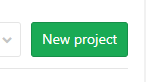
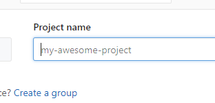
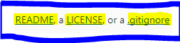
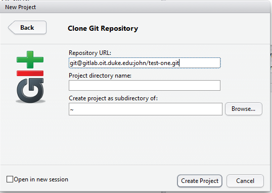
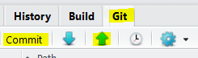

```{r, message=FALSE, warning=FALSE, include=FALSE}
library(tidyverse)
library(DT)
```

```{r loaddata, message=FALSE, warning=FALSE, include=FALSE}
hubs <- read_csv("~/R/github/git-tutorial/data/hubs.csv")
```

### Generate SSH Keys 

This must be done on each workstation you use to *push*.  

- https://gitlab.oit.duke.edu/help/ssh/README

This step was covered in the [Outline Section](outline.html#generate_ssh_keys_in_advance_of_the_workshop)

## Make a Repository
1. Duke's GitLab -- <a href="https://gitlab.oit.duke.edu" target="_blank">https://gitlab.oit.duke.edu</a>
1. Duke Shibboleth Login
1. New Project

    > 
    
1. Add a project name.  Use the name *test-one*  

    >  `-->` `test-one` 
    
    >  <br> Create Project
    - GitLab will present a new page.  Notice the section below the *Command line instructions* header.  That information can come in handy.  For future repositories, you may want to make a note of those *Git* commands.  We will not use those commands today so you can move on.
    
1. Make a README file 
    
    1. >  <br>Open in a New Tab, click the README link
    1. Make a top level heading with the word "README"
    
        - i.e. type:  `#README` 
        - See [Markdown](markdown.html) for more information on Markdown tagging
    1. After a blank line type: `This is my first GitLab repository.`
    1. Commit changes  
    
    &nbsp; 
    
1. Make a license file (Open in a New Tab, click the LICENSE link) 

    1. >  <br> *Appply a license format* 
    
        - choose *MIT* license, or paste a [Creative Commons](https://creativecommons.org/share-your-work/) License into license.md
    1. Commit changes
    
    &nbsp; 
    
1. Make a .gitignore file (Open in a New Tab, click the .gitignore link)

    1. *Apply a .gitignore format* 
    
        - choose *R* 
        
    1. Commit changes
    
1. Congratulations.  You've just created your first GitLab repository.  Click *test-one* in the top-left of your GitLab repo screen.  Now you'll see your repository -- including the three files you just created.

&nbsp; 

## Clone

**Using RStudio**, clone your repository.  Cloning will pull down the whole repo to your local system -- including the three files you just created.
    
### Bring the repo down locally via RStudio

1. Copy GitLab repo URL to clipboard 

	  - The repo should be at a location like this. `https://gitlab.oit.duke.edu/<<your-NetID>>/test-one`, copy the *git* URL to the clipboard by clicking the icon
	  - >  <br> Copy the repo URL
	    
1. Launch RStudio and create a *New Project...*

    1. From the RStudio menubar:  *File > New Project...* > Version Control > Git
    
        - Paste the GitLab repo URL (from the step above) into the  *Repository URL:* field in RStudio <br>
	    
        - > 
	    
    1. Create Project
    1. You may get prompted with a message which asks if you are going to authenticate.  The answer is `yes`.

&nbsp; 

## Push: Edit and Commit

**Continue in RStudio**.  This time you'll make local changes by editing your local repository.  After saving the changes you'll *add* and *commit* the changes.  Lastly, you will *push* your changes up to the remote repository.

 

&nbsp;  

### Edit

1. In the Files Pane, Open the README.md file
1. In the Editor Pane, modify your README with [Markdown](markdown.html)

    - Make a Sub-heading with the word "Purpose"
    
        - i.e. `##Purpose`
        
    - After a blank line type: `This is my first Git repository.  I'm going to push this file to GitLab via RStudio.  Hello World.`
1. Save the changes to this file


### Commit & Push

1. In the Git pane:

    1. Check each of the staged files
    1. Click *commit* and provide a message:  `this is my first edit of a README and supporting files`
    1. Click the *commit* button to engage your commit  process with the message, then close
    1. Click the *Push* arrow, then close, then close the commit dialogue box  
1. View your changes back at GitLab:  `https://gitlab.oit.duke.edu/<<your-NetID>>/test-one`

&nbsp; 

## Pull

The next time you open your project in RStudio the first step you should take is to *Pull* from the GitLab repo.  Then make your changes, then commit and push.  If you forget to *Pull* you make have to resolve some conflicts so get into the habit of pulling before you make edits.


&nbsp;

## Public or Private Repositories

- `https://gitlab.oit.duke.edu/<<your-NetID>>/test-one` > Settings > Scroll to *Project Visibility* > right-hand drop-down list:  Private | Public
- Add a Description (Optional)
- Add Tags (Optional)  

&nbsp; 

## Public Hubs v Duke's Hub

```{r, echo=FALSE, message=FALSE, warning=FALSE}
datatable(hubs, rownames = FALSE, options = list(dom = 't')) %>% 
  formatStyle("Duke's GitLab", color = "silver", backgroundColor = "navy", fontWeight = "bold") %>% 
  formatStyle("Public Hubs", backgroundColor = "lightblue")
```


&nbsp; 

&nbsp;