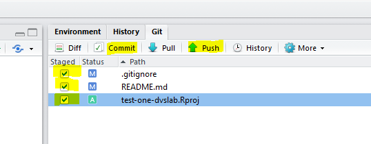

### Configure 

This step was covered in the [Outline Section](outline.html). In that section you have associated your GitHub Personal Access Token with your local git config file. This must be done on each workstation you use to *push* to a GitHub repository.  

## Make a New Repository

1. Create a new RStudio Project.  The name of the Directory/Project should be **test-one**.  (How to [video - 40 seconds](https://youtu.be/etkSsF6r2iU))
1. In the Rstudio Console: `library(usethis)`
1. In the Console:  `use_git(message = "first commit for my helo world")`
1. Create a Readme File:  `use_readme_md()`   (Edit your README.  [Example README template](https://gist.github.com/PurpleBooth/109311bb0361f32d87a2))
1. Push your repository to GitHub:  `use_github(protocol = "https")`
1. Add a license:  [GitHub instructions](https://help.github.com/articles/adding-a-license-to-a-repository/)
1. Pull the GitHub changes to your local workstations via Rstudio's git client
1. Congratulations.  You've just created your first GitHub repository.  Now you can see your repository -- including the three files you just created.

&nbsp; 

## Push: Edit and Commit

**Continue in RStudio**.  This time you'll make local changes by editing your local repository.  After saving the changes you'll *add* and *commit* the changes.  Lastly, you will *push* your changes up to the remote repository.

 <figure></figure>

### Edit

1. In the Files Pane, Open the README.md file
1. In the Editor Pane, modify your README with [Markdown](markdown.html)

    - Make a Sub-heading with the word "Purpose"
    
        - i.e. `## Purpose`
        
    - After a blank line type: `This is my first Git repository.  I'm going to push this file to GitHub via RStudio.  Hello World.`
1. Save the changes to this file

### Commit & Push

1. In the Git pane:

    1. Check each of the staged files
    1. Click *commit* and provide a message:  `this is my first edit of a README and supporting files`
    1. Click the *commit* button to engage your commit  process with the message, then close
    1. Click the *Push* arrow, then close, then close the commit dialogue box  
 <figure></figure> 

1. View your changes back at GitHub:  `https://github.com/<<your-ID>>/test-one`

&nbsp; 

## Pull

The next time you open your project in RStudio the first step you should take is to *Pull* from the GitHub repo.  Then make your changes, then **commit** and push.  If you forget to *Pull* you may have to resolve some conflicts. For best results, get into the habit of pulling before you make edits.

 <figure></figure> 

Advance to Hands-On, Part 2:  [Branch / Merge / Revert](handson_branch.html)

&nbsp; 

&nbsp;