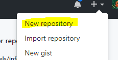
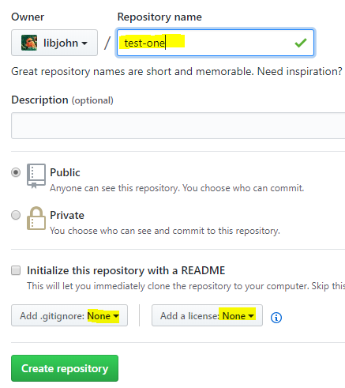
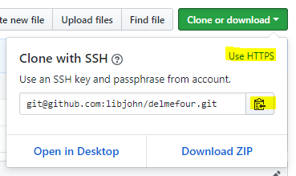
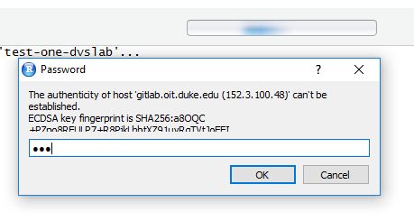

### Generate SSH Keys 

This step was covered in the [Outline Section](outline.html#generate_ssh_keys_in_advance_of_the_workshop).  This must be done on each workstation you use to *push*.  

## Make a Repository
1.Login to GitHub -- <a href="https://github.com" target="_blank">https://github.com</a>

1. New repository  <figure></figure> 

1. Add a repository name.  Use the name *test-one*    <figure><figcaption>Type  'test-one' and add a short description</figcaption></figure> 

1. Change "Add .gitignore" from **None** to **R**
1. Change "Add a license" from **None** to ** MIT License**
1. Click **Create repository** 

    - GitHub will present a new page.

1. Click the green "Add a README" button 

    1. Make a top level heading with the word "#README"
   
        - See [Markdown](markdown.html) for more information on Markdown tagging
    1. After a blank line type: `This is my first GitLab repository.`
    1. Click the green **Commit new file** button  
    
1. Congratulations.  You've just created your first GitHub repository.  Now you can see your repository -- including the three files you just created.

&nbsp; 

## Clone

**Using RStudio**, clone your repository.  Cloning will pull down the whole repo to your local system -- including the three files you just created.
    
### Bring the repo down locally via RStudio

1. Copy GitHub repo URL to clipboard by clicking on the green **Clone or Download** button

	  - The repo should be at a location like this. `https://github.com/<<your-NetID>>/test-one`
	  - Click the **Use SSH** link, then the clipboard icon to copy the repository address.  This will copy the *git* URL to the clipboard  <figure>
<figcaption>Copy the repo URL</figcaption></figure> 
	    
1. Launch RStudio and create a *New Project...*

    1. From the RStudio menubar:  *File > New Project...* > Version Control > Git  <figure><figcaption>Paste the GitLab repo URL (from the step above) into the  *Repository URL:* field in RStudio</figcaption></figure> 
    1. Create Project
    1. You may be prompted with a message which asks if you about the "authenticity of host".  I like to verify the IP number is correct; then the answer is `yes`. <figure></figure> 

&nbsp; 

## Push: Edit and Commit

**Continue in RStudio**.  This time you'll make local changes by editing your local repository.  After saving the changes you'll *add* and *commit* the changes.  Lastly, you will *push* your changes up to the remote repository.

 <figure></figure>

### Edit

1. In the Files Pane, Open the README.md file
1. In the Editor Pane, modify your README with [Markdown](markdown.html)

    - Make a Sub-heading with the word "Purpose"
    
        - i.e. `## Purpose`
        
    - After a blank line type: `This is my first Git repository.  I'm going to push this file to GitLab via RStudio.  Hello World.`
1. Save the changes to this file

### Commit & Push

1. In the Git pane:

    1. Check each of the staged files
    1. Click *commit* and provide a message:  `this is my first edit of a README and supporting files`
    1. Click the *commit* button to engage your commit  process with the message, then close
    1. Click the *Push* arrow, then close, then close the commit dialogue box  
 <figure></figure> 

1. View your changes back at GitLab:  `https://gitlab.oit.duke.edu/<<your-NetID>>/test-one`

&nbsp; 

## Pull

The next time you open your project in RStudio the first step you should take is to *Pull* from the GitLab repo.  Then make your changes, then **commit** and push.  If you forget to *Pull* you may have to resolve some conflicts. For best results, get into the habit of pulling before you make edits.

 <figure></figure> 

Advance to Hands-On, Part 2:  [Branch / Merge / Revert](handson_branch.html)

&nbsp; 

&nbsp;