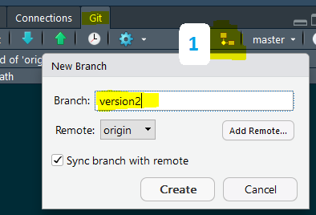
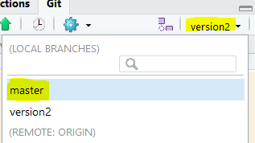

This document follows set-up from the [previous document](handson.html)

## Standard Edit

- Add your name and a bulleted list with three of your favorite foods
- Commit your changes

## Branch
1. Create a branch *version2*

    - The funny icon is used to **create** and **checkout** a branch
    - By clicking **Create**, `git checkout <<branch-name>>` is invoked
    - Create a new text that lists 3 favorite movies save it as `movies.md`
    - Commit your changes
    
```{r echo=FALSE, fig.align='center'}

```
    
2. Checkout the *master* branch

    - Watch the **Files** tab as you switch back to the *master* branch.  Where is the `movies.md` file?

```{r echo=FALSE, fig.align='center'}

```

3. Checkout the *version2* branch again

    - Edit the README.md file by adding 3 of your favorite books
    - Commit your changes
    - Push your changes
    
4. Observe the visual representations of the branching and updating.  <<Git - Clock>> -OR- GitHub > Settings > Insights > Network

## Merge
    
5. Checkout the *master* branch

    - In the Terminal window type:  `git merge version2`
    - You should see a terminal response similar to below...
    - Then, Push your changes
    
``` bash
Updating 83fb5bb..08c9267
Fast-forward
 README.md | 8 +++++++-
 movies.md | 5 +++++
 2 files changed, 12 insertions(+), 1 deletion(-)
 create mode 100644 movies.md

```

6. Observe the visual representations of the version history

## Conflict

7. Edit README.md in *master* by changing your name. Commit then Push.
8. Edit README.md in *version2* by changing the name to something different from the step above. Commit then Push.
9. Checkout *master*, then `git merge version2`
10. Fix Conflicts, then Save. ; Commit and Push.

## Revert

11. Checkout *master*
12. Create New text file, `colors.md` and list three of your favorite colors
13. Commit and Push
14. Add a fourth color to `colors.md` ; Commit and Push
15. Observe the visual representations of the version history
16. Now *revert* the last change because you changed your mind and you don't have four favorite colors.  In the terminal window type...

``` bash
git revert HEAD
```

- `:wq`

17. Commit and Push.
1. Observe the visual representations of the version history

    

    
