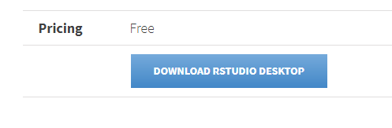
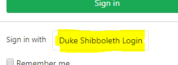
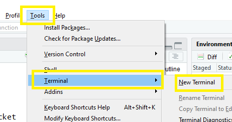

## Overview

1. Git
1. GitHub and GitLab and Bitbucket

    - Duke's GitLab  
    
1. Markdown  
1. Orchestrating with RStudio

	- Masks the CLI
	- Easier to get started
	- PowerUsers can still use commands
	
## Prerequisites

### Load & Install Software **Before the Workshop**

To complete the hands-on portion of the workshop you'll need software pre-installed.  Due to the nature of the workshop we will not have time to troubleshoot installations during the workshop.  Please be sure to perform the following steps **on the laptop you bring to the workshop**.  

### Required Software

#### Download and install  

I recommend accepting the install defaults for the following:

- **Git**: https://git-scm.com/downloads

    1. Download and install Git    
    1. Run the install and accept all the defaults
    
- **R**: http://archive.linux.duke.edu/cran/

    - If you have not installed R before choose *install R for the first time*
    - If you already have R installed on your workstation I recommend running the latest version, but any reasonably current version should be fine.
    
- **RStudio**: https://www.rstudio.com/products/rstudio/download/#download    
    
- If you haven't yet, install each of those programs

### **Duke's** GitLab -- Verify *your NetID* Access

During the Workshop we will use [Duke's Gitlab](https://gitlab.oit.duke.edu) implementation.  To complete the hands-on portion of the workshop, you **must log-in** -- **in advance** of the workshop -- and ensure you have NetID access to https://gitlab.oit.duke.edu.  If you do not have access to **Duke's** GitLab, [contact OIT](https://oit.duke.edu/help).

- Be certain you login via "Duke Shibboleth Login" using your NetID     

### Genearte SSH keys in Advance of the Workshop

I recommend generating your SSH keys in advance of the workshop.  To do so, you should have already installed Git to your laptop.  Then follow these instructions for generating the keys.  We will cover key configuration in the workshop although you will find the explanation easier to if you generate your keys in advance.

1. To begin, open a shell **from RStudio**

    - In RStudio > Menubar > `Tools > Shell...`   
    
1. Follow the instructions https://gitlab.oit.duke.edu/help/ssh/README

    - You can stop at Step 5 of *[Generating a new SSH key pair](https://gitlab.oit.duke.edu/help/ssh/README#generating-a-new-ssh-key-pair)*
1. Close the Shell
