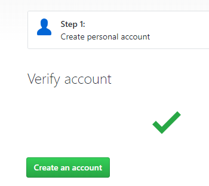

## Hands-on Outline

1. Git
1. GitHub and GitLab and Bitbucket
1. Markdown  
1. Orchestrating with RStudio

	- Masks the CLI
	- Easier to get started
	- Power Users can still use commands
	
## Prerequisites

### Load & Install Software **Before the Workshop**

To complete the hands-on portion of the workshop you'll need software pre-installed.  Due to the nature of the workshop we will not have time to troubleshoot installations during the workshop.  Please be sure to perform the following steps **on the laptop you bring to the workshop**.  

### Required Software

#### Download and install  

I recommend accepting the install defaults for the following:

- **Git**: <a href="https://git-scm.com/downloads" target="_blank">https://git-scm.com/downloads</a>

    1. Download and install Git
    1. Run the install and accept all the defaults
    
 <figure><figcaption>Click on the link to your OS</figcaption></figure> 
    
- **R**: <a href="http://archive.linux.duke.edu/cran/"" target="_blank">http://archive.linux.duke.edu/cran/</a>

    - If you have not installed R before choose *install R for the first time*
    - If you already have R installed on your workstation I recommend running the latest version, but any reasonably current version should be fine.
    
- **RStudio**: <a href="https://www.rstudio.com/products/rstudio/download/#download" target="_blank">https://www.rstudio.com/products/rstudio/download/#download</a> 

 <figure></figure> 
    

If you haven't yet, install each of the above applications.  

### Create GitHub Account and Verify Access
We will use  <a href="https://github.com" target="_blank">GitHub</a> to create an initial public host for the repository you create during the workshop.  (GitHub is free.  If you choose not to continue using GitHub, you can easily [delete the account](https://help.github.com/articles/deleting-your-user-account/). )   If you already have a GitHub account, you do not need to create another for this workshop.  

1. Sign up for GitHub using the form on their front page:  https://github.com.  Use your Duke email address
1. , Then Create the Account  

#### Additional Private Repository Options
- Students can use the [GitHub Student Pack](https://education.github.com/pack) that affords free unlimited private repositories
- Other unlimited private repository options include the [Duke University instance of GitLab](https://gitlab.oit.duke.edu), [GitLab.com](http://gitlab.com), or [BitBucket](https://bitbucket.org/).  Using the `git remote` features it is easy to create private repositories at one social coding site while also publishing public repositories to another social coding site.  I've been very happy using Duke's GitLab for my private repositories and GitHub for my public profile.

### Generate SSH keys in Advance of the Workshop

I recommend generating your SSH keys in advance of the workshop.  Then add your public key to GitHub.  To do so, you should have already installed Git to your laptop.  

We will cover key configuration in the workshop although you will find the explanation easier to follow if you generate and add your keys in advance.  The instructions below are based on those found at Duke's GitLab.  If the instructions below are not clear you should consult the more complete GitHub instructions to [generate and add an SSH key](https://help.github.com/articles/generating-a-new-ssh-key-and-adding-it-to-the-ssh-agent/)  

1. To begin, open the **Terminal** *in RStudio*.  If you're using the latest version of RStudio, the *Terminal* is a tab in the console quadrant (typically the bottom-left)

    - In RStudio: Menubar `Tools > Terminal > New Terminal` 

 <figure></figure> 

    
2. Determine if you already have an SSH key pair.  In the *Termnal* tab, type:  `cat ~/.ssh/id_rsa.pub`
    
    - If you see a string starting with `ssh-rsa` you already have an SSH key pair and can simply copy that key (Step 5)
        
    - If you get some kind of error, you'll have to generate a key in the next step
        
1. In the *Terminal* tab, type:  `ssh-keygen -t rsa -C "your.email@example.com" -b 4096`

    - I recommend using your Duke Email address but it must be the address you used to create your GitHub account
    
1. You will be prompted to input a file path.  i.e. the location where you'll save your SSH key pair.

    - If you don't already have an SSH key pair use the suggested path by pressing enter
    
     - After setting the file path you will be prompted to input a password.  This will secure your SSH key pair. It is a best practice to use a password for an SSH key pair, but it is not required.  You can skip creating a password by pressing enter

        - **Note**:  If you want to change the password of your SSH key pair, you can use `ssh-keygen -p <keyname>`  
    
1. Copy the public SSH key to the clipboard buffer

    - In the *Termnal* tab, type the appropriate code below:
        - **macOS**:  `cat ~/.ssh/id_rsa.pub | pbcopy`
        - **Windows**:  `cat ~/.ssh/id_rsa.pub | clip`
    
1. The final step is to add your public SSH key to GitHub.

    - Navigate to the *SSH and GPG keys* section of your GitHub *Settings*.  Click the green **New SSH key** button and paste your key in the *Key* section.  Give the key a relevant *Title*  Use an identifiable title like *Work Laptop - Windows 7* or *Home MacBook Pro 15.*
    
    - If you manually copied your public SSH key make sure you copied the entire key starting with `ssh-rsa` and ending with your email.