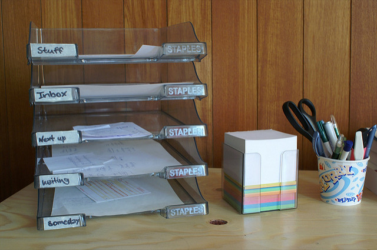
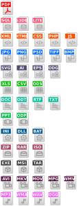
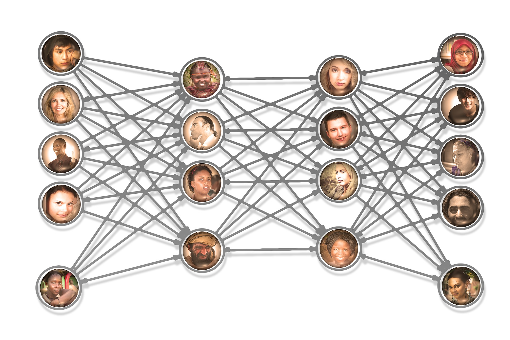

exclude: true

```{r, message=FALSE, warning=FALSE, include=FALSE}
library(tidyverse)
library(DT)
```


---
exclude: false
class: top, center
background-image:  url(http://library.duke.edu/data/sites/default/files/datagis/images/data_gis_logo.png)

## Data & Visualization Services
### [library.duke.edu/data](http://library.duke.edu/data)

Slides `->` [foo_URL](#)

???

This is a presenter comment for the presenter mode

use 'p' to toggle the presenter mode or '?' or 'h' to toggle the help / key-shortcut options

Image credit: [Wikimedia Commons](https://commons.wikimedia.org/wiki/File:Sharingan_triple.svg)


---

## Outline

1. Git

1. GitHub and GitLab and Bitbucket

1. Markdown  

1. Orchestrating with RStudio

---
class: center, middle, softblue

## **Git** is a *Version Control System*

---
class: bottom, right
background-image:  url(images/flickr_RupertsDogBoye_trail.jpg)


Image Credit: [Brandon Rasmussen](https://www.flickr.com/photos/137029081@N02/30943501632/in/photostream/)


---
exclude: true
class: top, right
background-image:  url(images/flickr_frits_ahlefeldt_hansel.jpg)


Image Credit: [Frits Ahlefeldt Hiking.org](https://www.flickr.com/photos/hikingartist/6996819414/in/photolist-bEhwDu-6guogg-9F3WfM-27RqzL-bKvrKv-a1YzBK-654W7Q.jpg)

---
## Repositories

.pull-left[


Image Credit: 
[Dennis Reimann](https://www.flickr.com/photos/dbloete/274563369)

- Source Code Management

- Track changes in any file set

]

.pull-right[

<br>Image Credit:  [OpenClipart.org](https://openclipart.org/detail/192197/file-extension-icons)


]

---
class: center, middle, softblue

## Social **git Repositories**

---
## Git Repositories

.pull-left[

Image Credit: [Wikimedia Commons](https://commons.wikimedia.org/wiki/File:LDEO_DSS_Repository.jpg)
]

.pull-right[

- Social Coding

- Sharing

- Collaboration

]

---
class: center


.pull-right[Image Credit: [PixaBay](https://pixabay.com/en/social-media-personal-1635581/)]
---
class: center
.pull-left[   ]
.pull-right[   ]


---
class: green, middle, center


## Duke's GitLab

http://gitlab.oit.duke.edu


---
## Duke's GitLab v Public Hubs

```{r, message=FALSE, warning=FALSE, include=FALSE}

col1 <- c("Private Repo", "Public Repo", "Duke NetId", "User Community") 
col2 <- c("by Default", "Yes", "Yes", "Duke University -- <br>can syncronize <br>to public hubs")
col3 <- c("$$", "by Default", "No", "Largest Available")

hubs <- tibble(col1, col2, col3) %>% 
  rename(Category = col1,
         `Duke's GitLab` = col2,
         `Public Hubs` = col3)

write_csv(hubs, "../data/hubs.csv")

```

    
```{r, echo=FALSE, message=FALSE, warning=FALSE}
datatable(hubs, rownames = FALSE, options = list(dom = 't')) %>% 
  formatStyle("Duke's GitLab", color = "silver", backgroundColor = "navy", fontWeight = "bold") %>% 
  formatStyle("Public Hubs", backgroundColor = "lightblue")
```

Public Hubs are defined as GitHub, BitBucket, and the public GitLab.

---
class: softblue, middle, center

## Markdown

---
class: middle
.pull-left[

&nbsp; 

```
# Heading

## Sub-heading

### Another deeper heading
 
Text attributes 
 *italic*, **bold**, `monospace`.

A [link](http://example.com).

Bullet list:
- apples  
- oranges  
- pears  

Numbered list:
1. apples
2. oranges
3. pears
```
]

.pull-right[
## Sub-heading

### Another deeper heading

*italicized*, **bold**, `monospace`

A [link](#14)

Bullet list:
- applies
- oranges
- pears

Numbered list:
1. apples
2. oranges
3. pears

]

---
class: bottom
background-image: url(images/rmarkdown.png)
Image Credit: [RStudio](http://rmarkdown.rstudio.com/)

---
class: orange, middle, center

## **Reproducible Data Science** 

Integrate your reproducible workflow using *Literate Coding* practices in *R* then generate reports directly from analysis 

### R Notebooks + R Markdown + Git


---
class: softblue, middle, center

## Rstudio & Git

---
## Orchestrating with RStudio

- Masks the CLI

- Easier to get started

- PowerUsers can still use commands

---
## Thank You For Attending

.pull-left[
### I am ...

- John Little
- https://johnlittle.info
- http://github.com/libjohn

#### Schedule Me

- [http:&#47;&#47;v.gd&#47;littleconsult](http://duke.libcal.com/appointment/2695)
]

.pull-right[
### We are...
- Data & Visualization Services
- http://library.duke.edu/data
- The /Edge, Bostock (1st Floor)

#### Walk-in Hours
- [Schedule](http://library.duke.edu/data/about/schedule)

#### Our Workshops
- [Current Workshops](http://library.duke.edu/data/news)
- [Past Workshops](http://library.duke.edu/data/news/past-workshops)

#### Contact Us
- askData@Duke.edu
]

---
class: center, middle
## Shareable 

Data, presentation, and handouts 

<span class="cc">
<!-- Key: a: SA, b: BY, c: CC Circle, d: ND, n: NC, m: Sampling, s: Share, r: Remix, C: CC Full Logo -->
C bn
</span>


[CC BY-NC license](https://creativecommons.org/licenses/by-nc/4.0/)